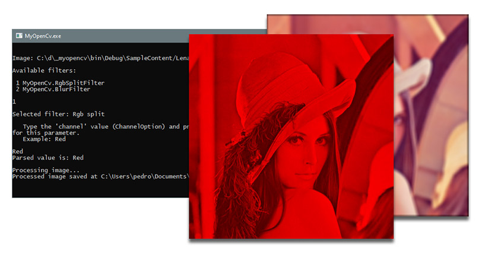

# MyOpenCv



MyOpenCv is a sample .NET implementation of OpenCV filters, programming model, and bundled application.

## Documentation

This document details programming and using filters using MyOpenCv.


### Creating filters

Filters are objects which perform processing on bitmaps via a `Process()` method.
A filter can be created by subclassing `InPlaceFilter` or `CopyFilter` (note `Filter` should not be subclassed directly).

Here is a sample in-place filter:

```c#
class Filter1 : InPlaceFilter // This filters performs its processing in-place.
{
    public override string Name { get { return "the_filter_name"; } }
    public override bool BitmapCondition(Bitmap bitmap)
    {
	    // This method specifies whether a given Bitmap image can be processed by this filter.
	    // Properties (such as number of channels) of the image can be inspected.
        return !((bitmap.Flags & (int)ImageFlags.HasTranslucent) == 
		        (int)ImageFlags.HasTranslucent);
    }
    public override void Process(Bitmap bitmap)
    {   
        // Do processing... Since this filter is in-place, we don't need to return a new 
        // Bitmap instance.
    }
}
```
And a sample copy filter:
```c#
class Filter2 : CopyFilter // This filters performs its processing in a copy.
{
    public override string Name { get { return "the_filter_name"; } }
    public override bool BitmapCondition(Bitmap bitmap)
    {
	    // This method specifies whether a given Bitmap image can be processed by this filter.
	    // Properties (such as number of channels) of the image can be inspected.
        return !((bitmap.Flags & (int)ImageFlags.HasTranslucent) == 
		        (int)ImageFlags.HasTranslucent);
    }
    public override void Process(Bitmap bitmap, out Bitmap newBitmap)
    {
        // Create a new Bitmap instance, note we are assigning the new instance directly to the 
        // output newBitmap variable
        newBitmap = new Bitmap(bitmap);
        
        // Do processing
    }
}
```
The main difference between them is in the `Process()` method: the copy filter one has an output `Bitmap` argument, whereas the in-place filter one hasn't.

### Defining filter parameters

Filter parameters are defined by adding `FilterParameterAttribute` attributes to `Filter` subclasses.
Filter parameters have a *name* and a *type*.
- The name is used to identify the parameter throughout the `Process()` code.
- The type is used to guarantee strong-typing of the filter parameter's value.

Here is an example:
```c#
[FilterParameter(typeof(FilterOption), "option")]
public class MyFilter1 : CopyFilter {
	public enum FilterOption {
		Option1, 
		Option2
	}
...
}
```
Here, the filter parameter named (and accessible through) `"option"` has a type of `FilterOption` defined inside the filter class. This parameter will only take values of type `FilterOption` by calling `SetParameter()` when the filter is used.

### Accessing parameter values

At runtime, the filter's execution context can access values attributed to its parameters by using the `Filter` class' `GetParameter<T>` method. This method receives a `string` containing the filter parameter's name and a type parameter `T` matching the type defined for the parameter value in the parameter attribute.
Example:
```c#
[FilterParameter(typeof(int), "par_name")] // Define two parameters
[FilterParameter(typeof(float), "par_name_2")]
class Filter3 : InPlaceFilter
{
    public override string Name { get { return "the_filter_name"; } }
    public override bool BitmapCondition(Bitmap bitmap)
    {
        return true; // This filter is applicable to all images
    }
    public override void Process(Bitmap bitmap, out Bitmap newBitmap)
    {
        var parVal = GetParameter<int>("par_name"); // Access a parameter value. Note 'int' must match 'int' defined above in the FilterParameter attribute.

		var parVal = GetParameter<float>("par_name_2"); // Access a second parameter value.
        
        // Do processing
    }
}
```
In case of non-matching parameter types, an exception will be thrown.

#### Default parameter values

The `defaultValue` property of `FilterParameterAttribute` can be used to specify a default value to be used for the parameter in case a value is not specified by the user:
```c#
[FilterParameter(typeof(int), "weight", defaultValue: 1)]
class Filter4 : CopyFilter {
...
}
```


### Using filters

A client application must initialize a filter object:
```c#
var filter = new Filter2();
```

After creating the filter instance, the image can be loaded for processing:
```c#
var bitmap = new Bitmap(@"c:\path_to_image\image.png"){
```

Then, the `Process()` method can be invoked, passing the image as argument:
```c#
filter.Process(bitmap)
```

After this call, if the filter is of the in-place kind, the `bitmap` image should already hold its new state.

For a copy filter, the call is a bit different:

```c#
filter.Process(bitmap, out Bitmap outBitmap);
```
This will process the image from `bitmap` *into* `outBitmap`.

When a filter is instantiated, a `SetParameter()` call must be made for each of the filter's required parameters, plus all optional parameters that are desired to be defined at the moment of processing. If any unset required parameters are accessed while processing the filter, an exception will be thrown.

### Application

The MyOpenCv bundled application supports automatically instancing filters from a configuration file.

Here is a sample `App.config` file containing a section for loading filters.

```c#
<?xml version="1.0" encoding="utf-8" ?>
<configuration>
  <appSettings>
    <add key="loadFilters" value="MyOpenCv.RgbSplit,MyOpenCv.Blur"/>
  </appSettings>
</configuration>
```
Rules:

- Filters are instantiated based on their class name (the `Filter` classes must be declared `public`).
- Each value separated by a comma is instantiated and kept as a single instance; parameter values are read interactively from the command-line prompt.
- Parameters are read from the corresponding `Filter` classes and values are prompted for.

The command-line application syntax is:

```c#
$ MyOpenCv [image_file] [filter_name]
```
The command-line application support the following operation cycle:

- If a filter is not specified, it can be chosen.
- In case a filter can't be found, an error message is displayed in the prompt.
- To use a newly-created filter with the application, add its fully-qualified class name to the list in the key `loadFilters` in the `appSettings` section.